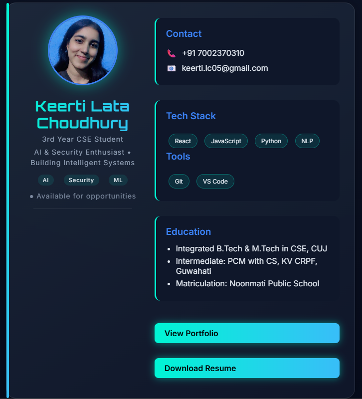

# 💳 Keerti Contact Card

A modern, responsive **developer contact card UI** built using HTML, CSS, and JavaScript.
Designed to act as a **digital identity card** for quick sharing of profile, skills, and contact details.

---

## ✨ Features

* 📱 Responsive layout (works on all devices)
* 🎨 Clean UI with glassmorphism + neon accents
* 🧑 Profile section with animated avatar
* 🏷️ Tech stack & tools displayed using interactive tags
* 📞 Click-to-call and 📧 click-to-email functionality
* ✨ Smooth hover effects and transitions
* 🔗 Quick access to portfolio & resume

---

## 🛠️ Tech Stack

* HTML5
* CSS3 (Flexbox, gradients, animations)
* JavaScript (DOM interactions)

---

## 📌 Status

⚠️ This project is an early project and is no longer actively maintained.

👉 Check out my latest portfolio here:
🔗 https://portfolio-keerti.vercel.app/

---

## 📸 Preview

---

## 💡 What I Learned

* Structuring layouts using Flexbox
* Creating modern UI using gradients and shadows
* Writing cleaner, modular CSS
* Handling DOM interactions in JavaScript
* Improving UI/UX through spacing, typography & hierarchy

---

## 🚀 Future Improvements (optional ideas)

* Dark/Light mode toggle
* Animations with GSAP or Framer Motion
* Converting into React component
* Adding QR code for quick sharing

---

## 📬 Connect With Me

* 💼 Portfolio: https://portfolio-keerti.vercel.app/
* 🐙 GitHub: https://github.com/your-username

---
